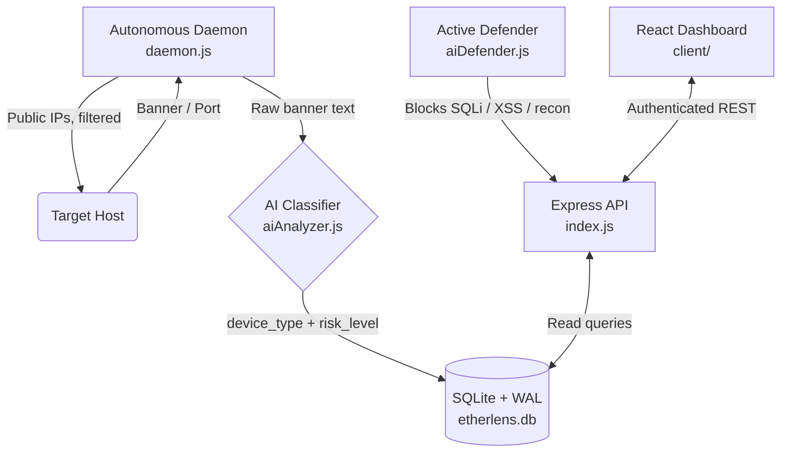

<div align="center">
  <h1>⬡ EtherLens</h1>
  <p><strong>An open-source, MIT-licensed internet observatory — a legal alternative to Shodan.io.</strong></p>

  [](https://opensource.org/licenses/MIT)
  [](https://github.com/johnvteixido/etherlens/actions)
  [](https://nodejs.org/)
  [](https://react.dev/)
  [](https://www.npmjs.com/package/@johnvteixido/etherlens)
  [](https://hub.docker.com/)

</div>

<br />

**EtherLens** is a self-hosted, open-source platform for autonomously discovering, cataloguing, and visualizing internet-connected devices — similar in spirit to [Shodan.io](https://shodan.io), but completely free, private, and AI-powered.

> **Legal Notice**: EtherLens only scans public IP addresses. RFC-1918 (private), loopback, and reserved address spaces are filtered out entirely. Always ensure you have permission to scan any network you target. The maintainers assume no liability for misuse. See [SECURITY.md](SECURITY.md).

---

## ✨ Features

| Feature | Details |
|---|---|
| 🔍 **Autonomous Scanner** | Async Node.js TCP daemon — 200+ concurrent sockets |
| 🤖 **AI Classification** | Naive Bayes banner classifier (no external API needed) |
| 🛡️ **Active AI Defense** | Live SQLi/XSS detection, recon blocking, IP quarantine |
| 🔐 **Hardened REST API** | Helmet, rate-limit, strict CORS, sanitized inputs |
| 🌍 **3D Globe Dashboard** | React 19 + react-globe.gl — real-time host visualization |
| 🗄️ **High-Performance DB** | SQLite + WAL mode for concurrent write throughput |
| 🐳 **Docker Ready** | `docker-compose up` and you're running |
| 📦 **npm Package** | `npm install @johnvteixido/etherlens` |

---

## 🏗️ Architecture



---

## 🚀 Quick Start

### Prerequisites
- [Node.js](https://nodejs.org/) v18+
- Git

### Option A — Manual

```bash
git clone https://github.com/johnvteixido/etherlens.git
cd etherlens

# Server
cd server
cp ../.env.example .env   # edit as needed
npm install
npm start                 # starts the REST API

# In a second terminal:
node daemon.js            # starts the autonomous scanner

# Client (third terminal)
cd ../client
npm install
npm run dev               # http://localhost:5173
```

### Option B — Docker (recommended)

```bash
git clone https://github.com/johnvteixido/etherlens.git
cd etherlens
cp .env.example .env
docker-compose up --build
```

The API will be available at `http://localhost:3001` and the dashboard at `http://localhost:5173` (run separately or serve the Vite build).

### Option C — npm

```bash
npm install @johnvteixido/etherlens
```

---

## 🔌 REST API

All protected routes require the `x-api-key` header.

| Method | Route | Auth | Description |
|---|---|---|---|
| GET | `/healthz` | None | Health check (used by Docker) |
| GET | `/api/search?q=...` | ✅ | Shodan-style search (port:22, country:US, type:Router) |
| GET | `/api/stats` | ✅ | Total hosts, top ports, top countries, risk levels |
| GET | `/api/ai/insights` | ✅ | Device category breakdown + high-risk hosts |
| GET | `/api/security/status` | ✅ | Live IP ban list and anomaly data |

### Search Query Syntax

```
port:22                  # Filter by port
country:USA              # Filter by country
type:Web Server          # Filter by AI device category
nginx                    # Full-text search in banner / IP
port:443 country:UK      # Combine filters
```

---

## 🔐 Security

- **API authentication** via `x-api-key` header (set `API_KEY` in `.env`)
- **Helmet** HTTP security headers on every response
- **Rate limiting** — 100 requests per 15-minute window per IP
- **Strict CORS** — only configured origins allowed
- **10 kb request body limit** — prevents JSON bomb attacks
- **Input sanitization** — query params stripped of SQL metacharacters
- **Parameterized queries only** — zero string interpolation into SQL
- **Active AI Defense** — real-time SQLi/XSS/recon blocking with live IP banning
- **Localhost bind** — API binds to `127.0.0.1` by default

To report a vulnerability privately, see [SECURITY.md](SECURITY.md).

---

## ⚙️ Configuration

Copy `.env.example` to `.env` in the repo root (or `server/`) and set:

| Variable | Default | Description |
|---|---|---|
| `API_KEY` | `etherlens_admin` | Shared secret for API access — **change this!** You can generate a secure one via: `node -e "console.log(require('crypto').randomBytes(24).toString('hex'))"` |
| `PORT` | `3001` | API server port |
| `CORS_ORIGINS` | `http://localhost:5173` | Comma-separated allowed origins |
| `CONCURRENCY_LIMIT` | `200` | Max concurrent scanner sockets |
| `TARGET_PORTS` | `22,80,443,21,3389,8080` | Comma-separated ports to probe |
| `SCAN_TIMEOUT_MS` | `2000` | Per-connection timeout (ms) |

---

## 🤝 Contributing

See [CONTRIBUTING.md](CONTRIBUTING.md). Please read our [Code of Conduct](CODE_OF_CONDUCT.md) before participating.

## 🐛 Issues & Features

Use our [Issue Tracker](https://github.com/johnvteixido/etherlens/issues). Follow the provided templates.

## 📜 License

This project is licensed under the MIT License - see the [LICENSE](LICENSE) file for details.

## 🚀 Roadmap

- [ ] **v1.1.0**: Integration with advanced AI models for vulnerability inference.
- [ ] **v1.2.0**: Native support for more protocols (SNMP, Telnet, Redis).
- [ ] **v2.0.0**: Distributed scanning nodes with centralized mesh control.

---

## 🛡️ Safety & Deployment
For detailed information on PC safety, legal compliance, and public deployment advice, see the [SAFETY_REPORT.md](SAFETY_REPORT.md).

---
*An Open Source Initiative by John V. Teixido.*
