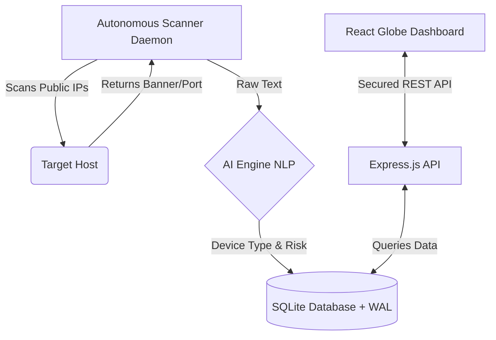

<div align="center">
  
  <h1>EtherLens</h1>
  <p><strong>A blazingly fast, autonomous, AI-powered internet observatory.</strong></p>

  [](https://opensource.org/licenses/MIT)
  [](https://github.com/johnvteixido/etherlens/actions)
  [](https://nodejs.org/)
  [](https://react.dev/)

</div>

<br />

Welcome to **EtherLens**—a lightweight, highly concurrent, AI-integrated network scanning engine designed to act as your own private internet observatory. It discovers, categorizes, and catalogs internet-connected devices using an optimized scanning core, backed by an intelligent classification system.

---

## 🚀 Features

- **Blazing Fast Scanning:** An asynchronous Node.js daemon capable of highly concurrent, rapid network mapping.
- **AI-Powered Insights:** Automatically categorizes service banners and evaluates security risks using built-in Machine Learning (Naive Bayes).
- **Secure by Default:** Comprehensive Bogon IP filtering, request rate-limiting, and hardened API endpoints.
- **Stunning UI:** A modern, visually stunning React dashboard with a 3D global visualization of discovered hosts.
- **Completely Private:** No external APIs required. Everything runs locally on your own infrastructure.

## 🏗️ Architecture



## 🛠️ Installation

### Prerequisites
- [Node.js](https://nodejs.org/) (v20+ recommended)
- Git

### Quick Start
```bash
# Clone the repository
git clone https://github.com/johnvteixido/etherlens.git
cd etherlens

# Install server dependencies
cd server
npm install

# Install client dependencies
cd ../client
npm install
```

## 💻 Usage

### Starting the Engine
Start up the backend API and the background scanning daemon:
```bash
cd server
npm start
```

*Note: You may need elevated privileges depending on the ports you are scanning and your OS environment.*

### Starting the Dashboard
In a separate terminal, spin up the React development server:
```bash
cd client
npm run dev
```
Navigate to `http://localhost:5173` to explore the universe of discovered devices!

## 🔐 Security & API Authentication

The API requests must be authenticated. By default, ensure your API client passes the shared secret token via the `x-api-key` header.
> Keep your API keys out of version control and manage them securely using `.env` variables in production environments.

## 🤝 Contributing

We welcome contributions from the community! Please read our [CONTRIBUTING.md](CONTRIBUTING.md) for details on our code of conduct, and the process for submitting pull requests to us.

## 🐛 Bug Reports & Feature Requests

Please use our [Issue Tracker](https://github.com/johnvteixido/etherlens/issues) to report any bugs or suggest new features. Ensure you follow the provided issue templates.

## 📜 License

This project is licensed under the MIT License - see the [LICENSE](LICENSE) file for details.


## 

## Active AI Defense
EtherLens features a unique "Active AI Defender" module that monitors performance and security live:
- **Real-time Threat Neutralization**: Automatically detects and blocks SQLi, XSS, and reconnaissance patterns.
- - **AI-Powered Banner Classification**: Uses Naive Bayes to classify device services and assess risk scores.
  - - **Adaptive Rate Limiting**: Dynamically adjusts API throughput based on detected usage patterns.
   
    - ## Roadmap
    - - [ ] **v1.1.0**: Integration with advanced AI models for vulnerability inference.
      - [ ] - [ ] **v1.2.0**: Native support for more protocols (SNMP, Telnet, Redis).
      - [ ] - [ ] **v2.0.0**: Distributed scanning nodes with centralized mesh control.
